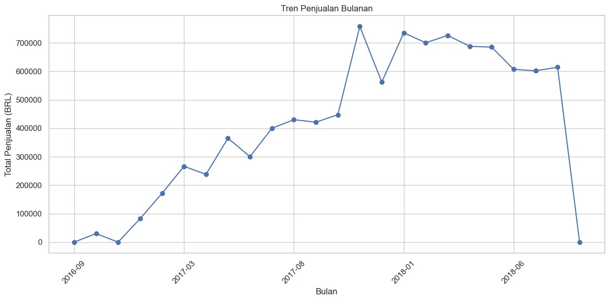
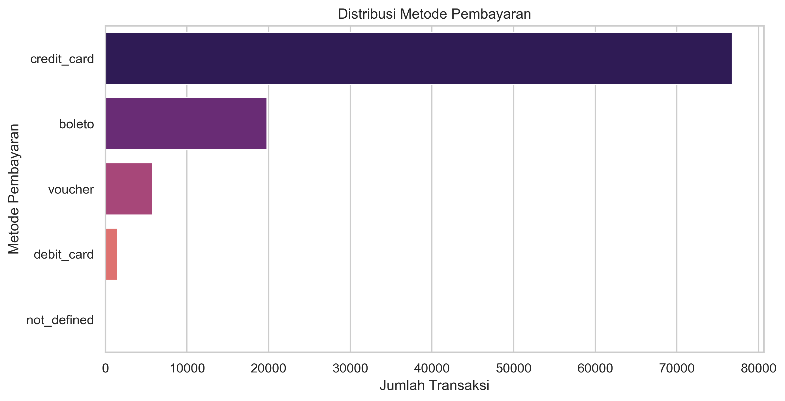

# Olist Sales Data Analysis / Analisis Data Penjualan Olist

## English
### Project Overview
This project analyzes Olist's e-commerce sales data, covering customer behavior, order trends, product performance, payment preferences, and customer segmentation.  
The analysis is based on the public Olist dataset and was originally developed as part of my **Beginner Data Analyst Certification** at GROWIA.

### Objectives
1. Identify key sales trends and seasonal patterns.
2. Highlight top-performing product categories.
3. Analyze customer satisfaction using review scores.
4. Segment customers using RFM and cohort retention analysis.
5. Provide actionable business recommendations.

### Key Insights & Visualizations

#### 1. Monthly Sales Trend
  
Sales increase toward the end of the year, especially in **November**, likely influenced by seasonal events such as **Black Friday** or year-end promotions.

#### 2. Review Score & Pareto Analysis of Product Sales
  
Most reviews have a score of **5**. Pareto chart shows the majority of revenue comes from a small number of product categories, indicating a focus on these can boost efficiency.

#### 3. Top Product Categories
  
Top categories: **bed_bath_table**, **health_beauty**, **sports_leisure** — recommended to focus marketing on these.

#### 4. Payment Method Distribution
  
Majority of customers use **credit card**. Payments via boleto and voucher are minimal.

#### 5. Sales by Day of the Week
  
**Monday** and **Tuesday** have higher transaction volumes — potential for targeted campaigns.

#### 6. RFM Segmentation - Clustering
  
Customers segmented into 4 clusters:
- Green: Loyal & high-value customers
- Orange: New customers with growth potential
- Red: Passive customers needing reactivation
- Blue: Customers close to churn

#### 7. Cohort Retention Analysis
  
Customer retention drops sharply after the first month — suggests implementing post-purchase engagement or loyalty programs.

#### 8. Elbow Method
  
Optimal number of clusters: **4** — beyond this point, inertia reduction is insignificant.

### Dataset
- **Source:** [Olist Public Dataset](https://www.kaggle.com/datasets/olistbr/brazilian-ecommerce)  
- **Period:** 2016–2018  
- **Size:** ~100k orders

### Tech Stack
- Python (Pandas, NumPy, Matplotlib, Seaborn)
- Jupyter Notebook
- GitHub for version control

### Contact
📧 **Email**: hfzmustafa07@gmail.com  

---

## Bahasa Indonesia
### Ringkasan Proyek
Proyek ini menganalisis data penjualan e-commerce Olist, meliputi perilaku pelanggan, tren pesanan, performa produk, preferensi metode pembayaran, dan segmentasi pelanggan.  
Analisis ini menggunakan dataset publik Olist dan awalnya dibuat untuk **Sertifikasi Data Analyst Beginner** di GROWIA.

### Tujuan
1. Mengidentifikasi tren penjualan dan pola musiman.
2. Menemukan kategori produk dengan kinerja terbaik.
3. Menganalisis kepuasan pelanggan melalui skor ulasan.
4. Melakukan segmentasi pelanggan dengan RFM dan cohort retention analysis.
5. Memberikan rekomendasi bisnis yang dapat diimplementasikan.

### Temuan Utama & Visualisasi

#### 1. Tren Penjualan Bulanan
  
Penjualan meningkat menjelang akhir tahun, terutama di **November**, kemungkinan dipengaruhi event musiman seperti **Black Friday** atau promo akhir tahun.

#### 2. Review Score & Pareto Penjualan Produk
  
Mayoritas ulasan bernilai **5**. Pareto chart menunjukkan sebagian besar pendapatan berasal dari sedikit kategori produk — fokus pada kategori ini dapat meningkatkan efisiensi.

#### 3. Kategori Produk Teratas
  
Kategori teratas: **bed_bath_table**, **health_beauty**, **sports_leisure** — disarankan fokus pemasaran ke kategori ini.

#### 4. Distribusi Metode Pembayaran
  
Mayoritas pelanggan menggunakan **kartu kredit**. Pembayaran via boleto dan voucher relatif kecil.

#### 5. Penjualan Berdasarkan Hari
  
**Senin** dan **Selasa** memiliki volume transaksi lebih tinggi — berpotensi untuk kampanye promosi terarah.

#### 6. Segmentasi RFM – Clustering
  
Pelanggan dibagi menjadi 4 cluster:
- Hijau: Pelanggan loyal & bernilai tinggi
- Oranye: Pelanggan baru dengan potensi tumbuh
- Merah: Pelanggan pasif yang perlu diaktivasi kembali
- Biru: Pelanggan hampir churn

#### 7. Analisis Retensi Cohort
  
Retensi pelanggan menurun tajam setelah bulan pertama — disarankan adanya edukasi pasca-pembelian atau program loyalitas.

#### 8. Elbow Method
  
Jumlah cluster optimal: **4** — penurunan inertia setelah ini tidak signifikan.

### Dataset
- **Sumber:** [Olist Public Dataset](https://www.kaggle.com/datasets/olistbr/brazilian-ecommerce)  
- **Periode:** 2016–2018  
- **Ukuran:** ~100 ribu pesanan

### Teknologi
- Python (Pandas, NumPy, Matplotlib, Seaborn)
- Jupyter Notebook
- GitHub untuk version control

### Kontak
📧 **Email**: hfzmustafa07@gmail.com  
